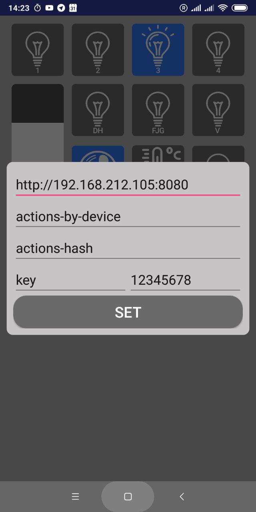
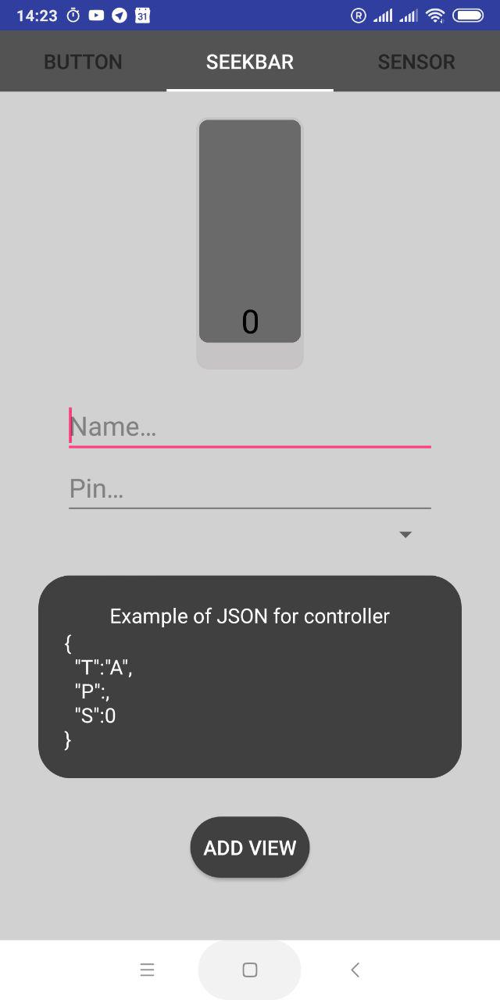
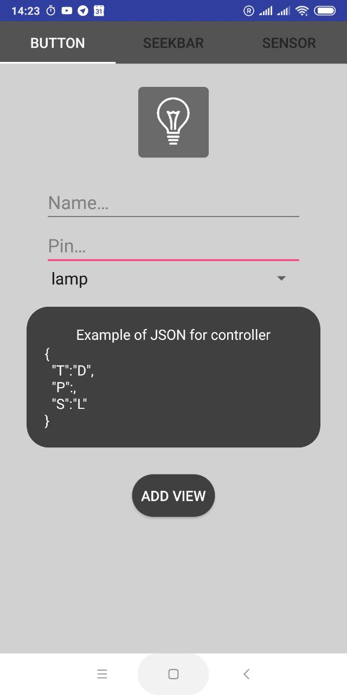
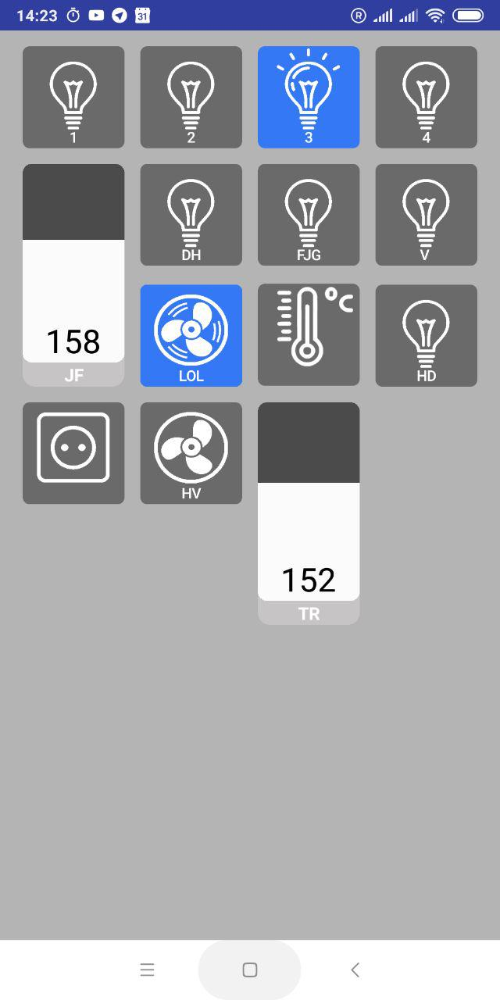

# Android-app-for-smart-home
The program "smart home" is for controling smart home by server.
The app just does POST reques with commands to server.
The app features dynamic interface. You can add search bar buttons or sensors and assign them ports on the <a href="">TCOD</a>.

&nbsp;

## <a href="https://github.com/AlieksieievYurii/Android-app-for-smart-home/tree/master/apk">Apk file</a>
